# DecentraChat 🛡️💬

> **Decentralized, End-to-End Encrypted Messaging Application**

DecentraChat is a secure, privacy-first messaging application built with Electron and React. It leverages WebRTC for Peer-to-Peer (P2P) communication and uses a fallback relay server only when direct connections are not possible. Identities are cryptographically generated (Ethereum-style wallets), ensuring true ownership and privacy without central user databases.

---

## 🚀 Key Features

*   **🔒 End-to-End Encryption**: Messages are encrypted using `tweetnacl` (Curve25519-XSalsa20-Poly1305) before leaving your device.
*   **⚡ Peer-to-Peer (P2P) First**: Direct WebRTC connections between users for minimal latency and maximum privacy.
*   **🌐 Hybrid Relay Fallback**: Seamless switch to WebSocket relay if P2P fails (e.g., rigid firewalls), maintaining E2EE.
*   **🆔 Blockchain-based Identity**: Users are identified by public keys (Wallet Addresses). No email or phone number required.
*   **👥 Group Chats**: Secure, client-side group management with admin privileges and invite systems.
*   **💾 Local-First Persistence**: Messages are stored locally using `localforage` (IndexDB), ensuring you own your data.
*   **🔄 Auto-Updates**: Seamless OTA updates via GitHub Releases.

---

## 🏗️ Architecture

### High-Level System Design

DecentraChat uses a hybrid architecture. The "Server" is only for signaling (introducing peers) and temporary offline message storage. It **cannot** read messages.

```mermaid
graph TD
    UserA[👤 User A]
    UserB[👤 User B]
    Signal[📡 Signaling Server]
    Relay[🔄 Relay Service]

    subgraph "Secure Zone (Client Side)"
        UserA
        UserB
    end

    %% P2P Path
    UserA -- "WebRTC (Direct P2P)" --> UserB
    UserB -- "WebRTC (Direct P2P)" --> UserA

    %% Signaling Path
    UserA -. "1. Handshake (SDP/ICE)" .-> Signal
    Signal -. "2. Forward Handshake" .-> UserB

    %% Relay Path (Fallback)
    UserA -- "3. Encrypted Msg (Fallback)" --> Relay
    Relay -- "4. Forward Encrypted Msg" --> UserB

    style UserA fill:#d4ffea,stroke:#00bf5c,stroke-width:2px
    style UserB fill:#d4ffea,stroke:#00bf5c,stroke-width:2px
    style Signal fill:#ffe6e6,stroke:#ff9999
    style Relay fill:#e6edff,stroke:#99bbff
```



### Application Components

The application is built on **Electron**, splitting logic between the Main Process (SystemOS interactions) and Renderer Process (UI/Logic).


### Message Lifecycle

1.  **Compose**: User writes message.
2.  **Encrypt**: `messageService` generates a shared secret using ECDH (Sender PrivKey + Recipient PubKey) and encrypts content.
3.  **Transport**:
    *   *Attempt 1*: Send via active **WebRTC DataChannel**.
    *   *Attempt 2*: If failed, emit via **Socket.io** to Relay Server.
4.  **Receive**: Recipient gets encrypted payload.
5.  **Decrypt**: Recipient uses their PrivKey + Sender PubKey to decrypt.
6.  **Verify & Store**: Message signature verified, then saved to `storageService`.

---

## 🛠️ Technology Stack

*   **Runtime**: [Electron](https://www.electronjs.org/)
*   **Frontend**: [React](https://reactjs.org/) + [Vite](https://vitejs.dev/)
*   **Networking**:
    *   [Simple-Peer](https://github.com/feross/simple-peer) (WebRTC)
    *   [Socket.io](https://socket.io/) (Signaling)
*   **Cryptography**:
    *   [TweetNaCl.js](https://tweetnacl.js.org/) (Encryption)
    *   [Ethers.js](https://docs.ethers.io/) (Wallet/Key management)
*   **Storage**: [LocalForage](https://localforage.github.io/localForage/) (IndexedDB wrapper)
*   **Styling**: CSS Modules + Glassmorphism Design

---

## 💻 Installation & Setup

### Prerequisites
*   Node.js (v18 or higher)
*   Git

### Development Setup

```bash
# 1. Clone the repository
git clone https://github.com/mrsarthi/Dicsussion.git
cd Dicsussion

# 2. Install dependencies
npm install

# 3. Run in Development Mode
npm run dev
# This starts both the Vite renderer server and Electron main process
```

### Building for Production

To create an installer (`.exe` for Windows):

```bash
npm run dist
```
*Artifacts will be in the `release/` directory.*

---

## 🚀 Deployment & Updates

DecentraChat supports **Auto-Updates**. To publish a new version:

1.  Update `version` in `package.json`.
2.  Run `npm run dist`.
3.  Go to **GitHub Releases**.
4.  Draft a new release (tag matching version, e.g., `v1.2.1`).
5.  **Important**: Upload both the `.exe` installer AND the `latest.yml` file generated in `release/`.
6.  **Publish** the release. The app will automatically detect and download the update.

---

## 🤝 Contributing

1.  Fork the Project
2.  Create your Feature Branch (`git checkout -b feature/AmazingFeature`)
3.  Commit your Changes (`git commit -m 'Add some AmazingFeature'`)
4.  Push to the Branch (`git push origin feature/AmazingFeature`)
5.  Open a Pull Request

---

## 📄 License

Distributed under the MIT License. See `LICENSE` for more information.
